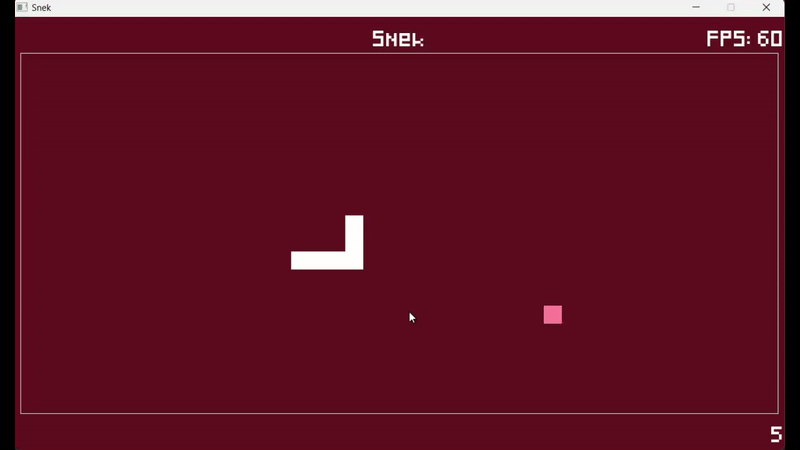

# Snek 

A simple snake game made in simple SDL2.

## Dependencies

- make >= 3.8

- gcc/g++ >= 13.1

## Local Release Instructions

1. Run: `mkdir release && cd release`
2. Ensure `libfreetype-6.dll`, `SDL2_image.dll`, `SDL2_ttf.dll` & `SDL2.dll` are present in this directory.
3. Copy `src/assets` directory to `release`.
4. Compile & run: `cd .. && make release && make rrun`.

## Local Build Dependencies

- MinGW-w64 

    - Suite of development tools, installed through MSYS2 from [here](https://www.mingw-w64.org/downloads/#msys2).

- SDL2 >= 2.0

  - Low level cross-platform development library, latest version found [here](https://github.com/libsdl-org/SDL/releases/latest).

- SDL2_ttf >= 2.0

  - Used to render fonts, latest version found [here](https://github.com/libsdl-org/SDL_ttf/releases/latest).

- SDL2_image >= 2.0

  - Used to load the icon, latest version found [here](https://github.com/libsdl-org/SDL_image/releases/latest).

- (Optional) Freetype
  
  - Used to render fonts _needed by SDL_ttf_, installed through msys2 using commands found [here](https://packages.msys2.org/package/mingw-w64-x86_64-freetype?repo=mingw64).

## Local Build Instructions

1. Copy installed SDL2, SDL2_ttf & SDL2_image include directories into `src/include`.
2. Copy SDL2, SDL2_ttf & SDL2_image lib directories in `src/lib`.
3. Copy SDL2, SDL2_ttf & SDL2_image dll into main directory.
4. Either install freetype or place `libfreetype-6.dll` in this directory.
5. Compile & run: `make && make run`.